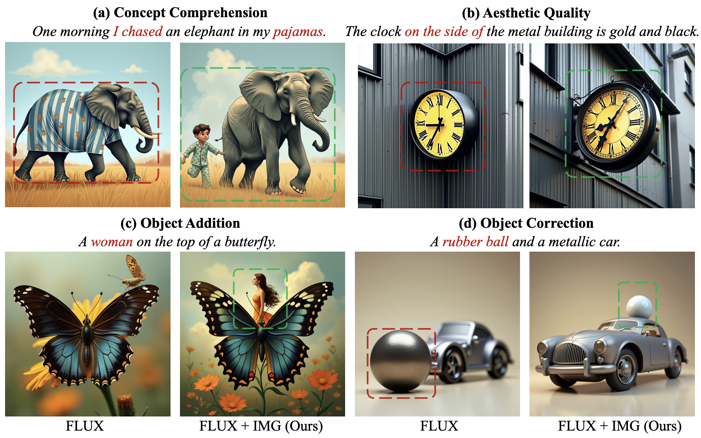
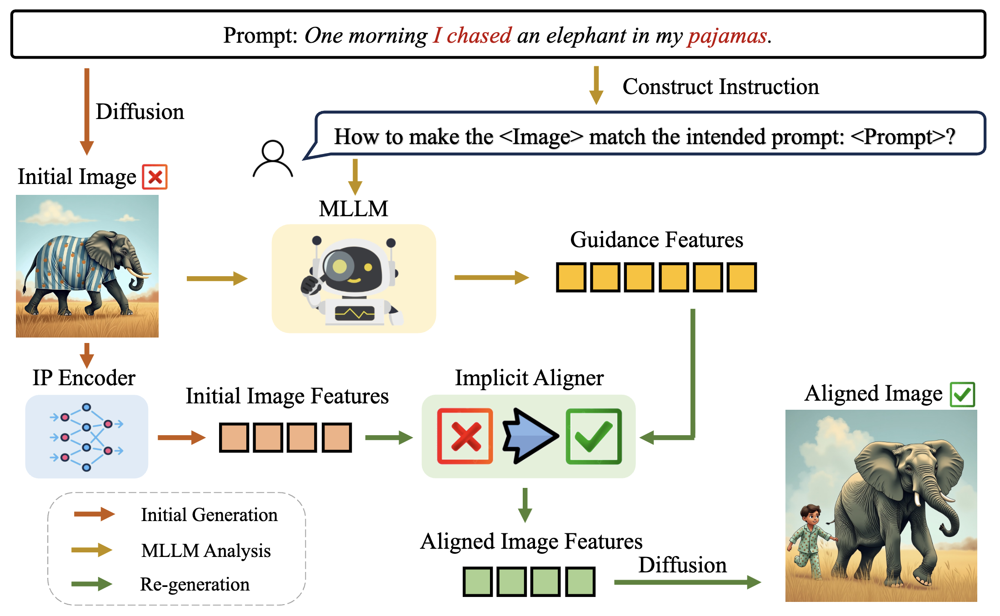

# IMG-Multimodal-Diffusion-Alignment

This repository is the official Pytorch implementation for [IMG](https://arxiv.org/abs/).

[](https://arxiv.org/abs/) 

> **IMG: Calibrating Diffusion Models via Implicit Multimodal Guidance.**  
> [Jiayi Guo](https://www.jiayiguo.net)\*,
> [Chuanhao Yan](https://openreview.net/profile?id=~Chuanhao_Yan1)\*,
> [Xingqian Xu](https://scholar.google.com/citations?user=s1X82zMAAAAJ&hl=zh-CN&oi=ao),
> [Yulin Wang](https://openreview.net/profile?id=~Yulin_Wang1),
> [Kai Wang](https://kaiwang.com),
> [Gao Huang](https://www.gaohuang.net),
> [Humphrey Shi](https://www.humphreyshi.com)

<p align="center">

Our proposed Implicit Multimodal Guidance (IMG) framework mitigates the prompt-image misalignment issues in various aspects such as concept comprehension, aesthetic quality, object addition, and correction. In each case, both images are generated with the same random seed for fair comparison.
</p>

## News
- [2025.09.30] Paper and code released!
- [2025.06.26] IMG is accepted by ICCV 2025!

## Overview

<p align="center">

Given an initial image with its prompt, IMG begins by conducting an MLLM-driven misalignment analysis. Following this, IMG utilizes an Implicit Aligner to translate the initial image features into better-aligned features according to the MLLM's guidance. Finally, these aligned image features are incorporated as new conditions to re-generate images with improved prompt-image alignment.
</p>

## Acknowledgements

Our code is developed on the top of [Diffusers](https://github.com/huggingface/diffusers), [LLaVA](https://github.com/haotian-liu/LLaVA), [IP-Adapter](https://github.com/tencent-ailab/IP-Adapter) and [x-FLUX](https://github.com/XLabs-AI/x-flux).

## Citation

If you find this repo helpful, please consider citing us.

```latex
@inproceedings{guo2025img,
  title={IMG: Calibrating Diffusion Models via Implicit Multimodal Guidance.},
  author={Jiayi Guo, Chuanhao Yan, Xingqian Xu, Yulin Wang, Kai Wang, Gao Huang, Humphrey Shi},
  booktitle={International Conference on Computer Vision},
  year={2025},
}
```
